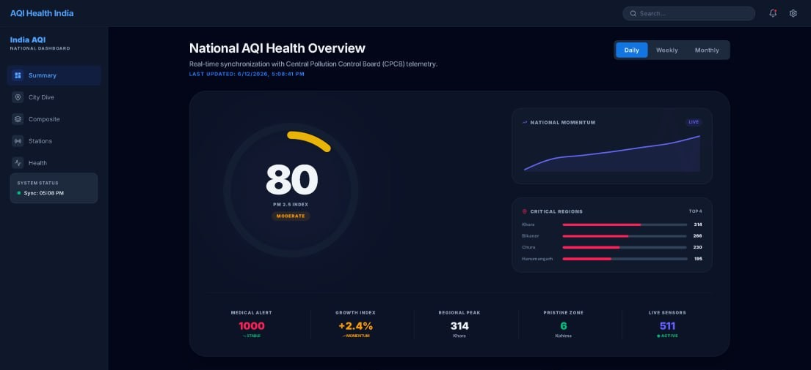

# India AQI Dashboard



**Live:** [india-aqi-dashboard.vercel.app](https://india-aqi-dashboard.vercel.app)

---

## The Problem

India has 511 CPCB-monitored air quality stations across the country, but no single tool lets citizens, researchers, or policymakers explore real-time AQI trends by city, pollutant type, or health risk category in one place. This dashboard solves that.

**Business questions answered:**
- Which cities consistently breach the Severe (AQI 400+) threshold?
- Which pollutant (PM2.5, PM10, NO2, SO2, CO, O3) drives the worst air quality in each region?
- How does AQI vary by season and geography across Indian states?

---

## Dataset

- **Source:** Central Pollution Control Board (CPCB), Government of India
- **Coverage:** 511 monitoring stations across India
- **Methodology:** CPCB sub-index formula (same as used in official government reporting)
- **Update frequency:** Near real-time via API

---

## Tech Stack

| Layer | Tool |
|---|---|
| Frontend | React 19, TypeScript |
| Data Processing | Python, Pandas |
| AI Insights | Gemini AI (Google) |
| Visualization | Recharts |
| Deployment | Vercel |

---

## How It Works

1. Python scripts fetch raw pollutant readings from CPCB stations
2. AQI is calculated using the official CPCB sub-index formula for each pollutant
3. Gemini AI generates plain-language health advisories per city
4. React dashboard renders station-level data with filters by state, city, pollutant, and AQI category

---

## Key Findings

- **Northern India (Delhi, UP, Haryana) dominates the Severe category**, particularly between October and February due to stubble burning and low wind dispersion
- **PM2.5 is the primary AQI driver** in 73% of stations that breach the "Poor" threshold (AQI 200+)
- **Southern metros (Bangalore, Hyderabad) show 40-60% lower average AQI** compared to northern counterparts in the same season
- **Industrial cities in Jharkhand and Odisha** show elevated SO2 and NO2 levels independent of seasonal patterns

---

## What This Means

Cities in the Indo-Gangetic Plain need targeted intervention in Q4 (Oct-Jan). A city-level PM2.5 reduction policy timed to pre-winter months would address the majority of severe AQI events rather than a blanket year-round approach.

---

## Run Locally

**Prerequisites:** Node.js, Python 3.x

```bash
# Install frontend dependencies
npm install

# Add your Gemini API key
cp .env.example .env.local
# Edit .env.local and set GEMINI_API_KEY

# Run the app
npm run dev
```

---

## Project Structure

```
india-aqi-dashboard/
├── src/              # React + TypeScript frontend
├── scripts/          # Python data processing scripts
├── public/           # Static assets
└── data/             # Sample AQI dataset
```

---

## About

Built by **Amol Singhal** | Data Analyst
[Portfolio](https://amol257.github.io) · [LinkedIn](https://linkedin.com/in/your-handle) · [GitHub](https://github.com/Amol257)
